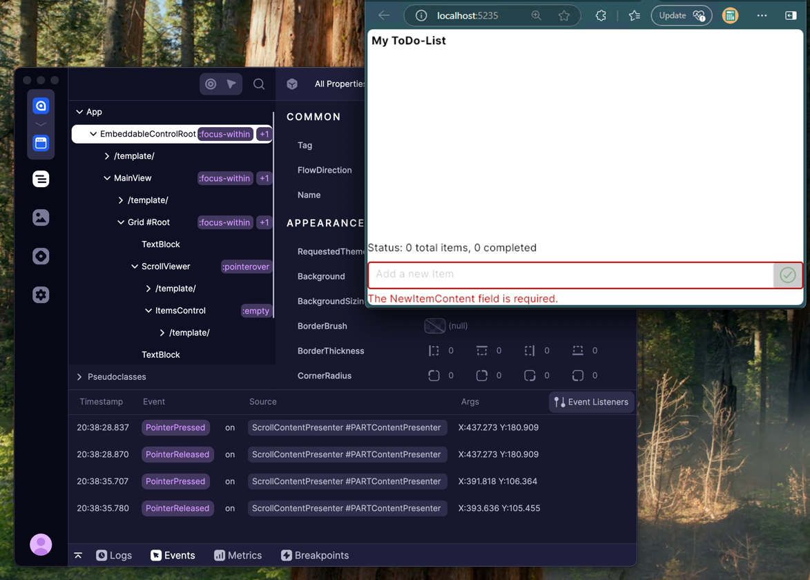
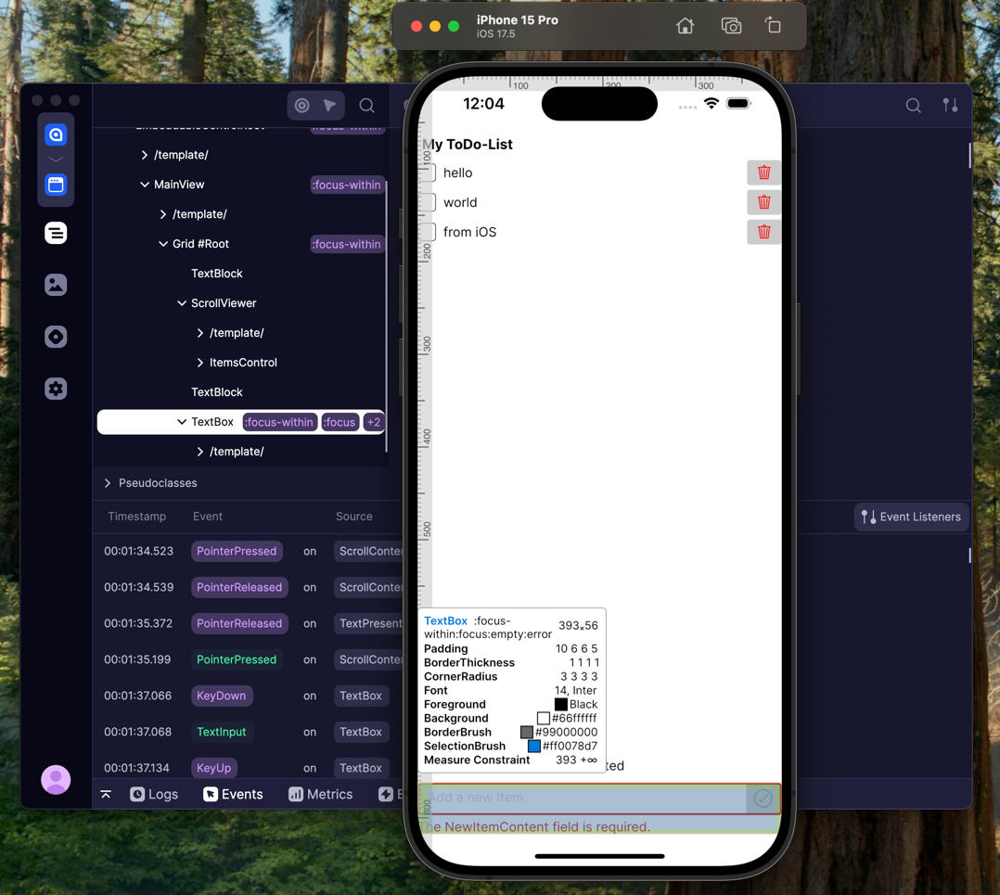
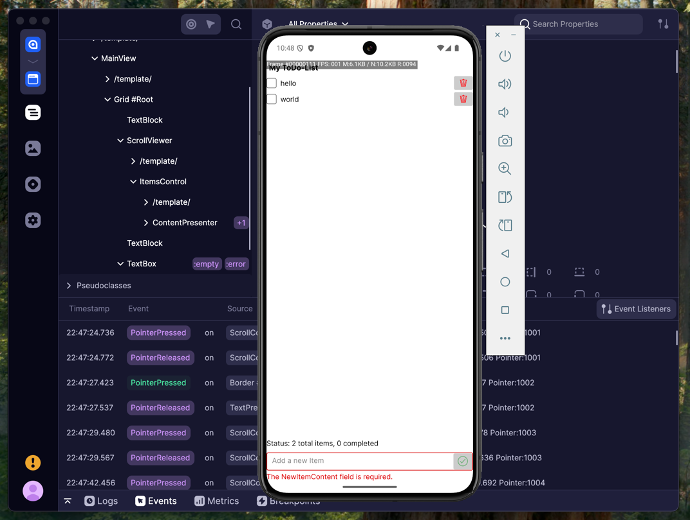

# Attaching Browser or Mobile application

This page assumes both apps are deployed on the same local network or same machine. For the remote connection, please visit [Attaching to the remote tools](./attaching-to-the-remote-tool.md).

:::note

For all platforms, `AvaloniaUI.DiagnosticsSupport` package can be installed in the shared project. As well as `this.AttachDeveloperTools()` code can be kept in the shared `Application` class. If any custom configuration is needed per each platform, `OperatingSystem.IsPlatform` APIs can be used. 

:::

## Attaching Browser application

1. Follow [Getting Started](../getting-started.md) for the initial setup.
2. Run `Developer Tools` application. `avdt` dotnet tool can be used from the command line.
3. Run browser application either via `dotnet run` or `dotnet serve` on a published project. Please visit [Avalonia WebAssembly documentation](https://docs.avaloniaui.net/docs/guides/platforms/how-to-use-web-assembly) for more details.
4. By default, iOS projects configured to attach to `Developer Tools` on startup. See [DeveloperToolsOptions.ConnectOnStartup](./options-reference.md#developertoolsoptionsconnectonstartup) for details.



:::note

To avoid conflicts with Chrome Developer Tools, Avalonia tools shortcut can be redefined from `F12` to a custom one. See [DeveloperToolsOptions.Gesture](./options-reference.md) for details.

:::

## Attaching iOS application


1. Follow [Getting Started](../getting-started.md) for the initial setup.
2. Run `Developer Tools` application. `avdt` dotnet tool can be used from the command line.
3. Run iOS application from your IDE. Please visit [Avalonia iOS documentation](https://docs.avaloniaui.net/docs/guides/platforms/ios/) for more details.
4. Make sure browser app is focused, so shortcut can be intercepted. Press `F12`.



## Attaching Android application

1. Follow [Getting Started](../getting-started.md) for the initial setup.
2. IMPORTANT: Android doesn't allow any HTTP traffic by default:
   1. Create `Resources/xml/network_security_config.xml` file:
   ```xml
   <?xml version="1.0" encoding="utf-8"?>
   <network-security-config>
     <domain-config cleartextTrafficPermitted="true">
       <domain includeSubdomains="true">10.0.2.2</domain> <!-- Debug address -->
     </domain-config>
   </network-security-config>
   ```
   2. In the AndroidManifest.xml file, update `<application>` xml node:
   ```xml
   <application android:networkSecurityConfig="@xml/network_security_config">
   ```
   3. For more details, visit https://devblogs.microsoft.com/xamarin/cleartext-http-android-network-security/
   4. `SimpleToDoList.Android` project in this repository also contains these changes for reference.
3. Run `Developer Tools` application. `avdt` dotnet tool can be used from the command line.
4. Run Android application from your IDE. Please visit [Avalonia Android documentation](https://docs.avaloniaui.net/docs/guides/platforms/android/) for more details.
5. By default, Android projects configured to attach to `Developer Tools` on startup. See [DeveloperToolsOptions.ConnectOnStartup](./options-reference.md#developertoolsoptionsconnectonstartup) for details.



:::note

`10.0.2.2` is a default IP address on Android instead of `localhost`. It's mapped by the emulator to target host machine. To override it see [DeveloperToolsOptions.Protocol](./options-reference.md#developertoolsoptionsprotocol).

:::